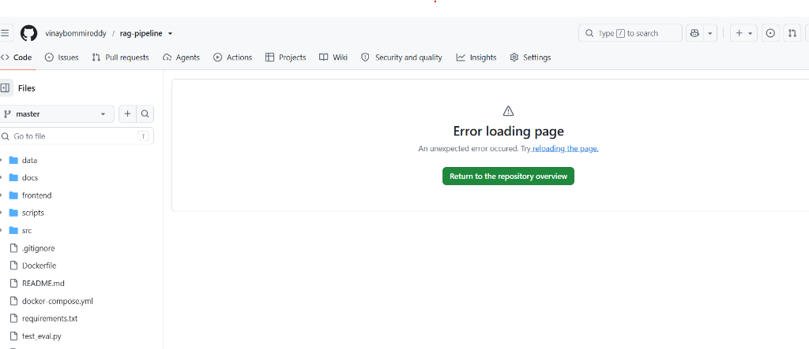

# Enterprise Hybrid RAG Pipeline with Safety Guards & Evaluation

A production-grade Retrieval-Augmented Generation (RAG) system built in Python. This pipeline ingests multi-format documentation, indexes it using both dense vector and sparse keyword search, retrieves context using Reciprocal Rank Fusion (RRF), and generates grounded answers with inline citations and automatic hallucination safety guards.



---

## 🚀 Key Features

* **Hybrid Retrieval (Dense + Sparse)**: Combines dense vector search (ChromaDB + SentenceTransformers `all-MiniLM-L6-v2`) with sparse keyword matching (BM25Okapi) using Reciprocal Rank Fusion (RRF) to capture both semantic intent and exact keywords.
* **Grounded Generation & Citation Verification**: Instructs the LLM (NVIDIA NIM / OpenAI) to cite specific chunks using bracketed references (e.g., `[1]`, `[2]`) and runs an LLM-as-a-judge verifier to ensure claims are backed by source text.
* **Confidence Safety Guard ("I Don't Know" Handler)**: Computes a composite confidence score across retrieval, citation coverage, and answer completeness. If the score falls below a 25% threshold, the engine abstains and returns a structured response showing what it found and where to check manually instead of hallucinating.
* **Evaluation Framework**: Built-in test suite evaluating 30+ golden Q&A pairs (factual, multi-hop, unanswerable, and ambiguous queries) to compare chunking strategies.
* **API & Dashboard**: Async backend service built with FastAPI and an interactive dashboard built with Streamlit.

---

## 📊 Evaluation Metrics (Recursive Chunking)

* **Answer Correctness**: **90.0%**
* **Faithfulness**: **76.7%**
* **Retrieval Relevance**: **100.0%**
* **Citation Accuracy**: **97.8%**

---

## 🛠️ Architecture

```
                  ┌───────────────────────┐
                  │   Document Ingestion  │ (TXT, MD, PDF, HTML)
                  └───────────┬───────────┘
                              ▼
                  ┌───────────────────────┐
                  │ Recursive Chunking    │ (Structure-aware)
                  └───────────┬───────────┘
                              ▼
         ┌────────────────────┴────────────────────┐
         ▼                                         ▼
┌───────────────────┐                     ┌───────────────────┐
│ Dense Embeddings  │                     │ Sparse Indexing   │
│ (all-MiniLM-L6-v2)│                     │ (BM25Okapi)       │
└────────┬──────────┘                     └────────┬──────────┘
         ▼                                         ▼
┌───────────────────┐                     ┌───────────────────┐
│ Vector Database   │                     │ Keyword Database  │
│ (ChromaDB)        │                     │ (Pickled Corpus)  │
└────────┬──────────┘                     └────────┬──────────┘
         │                                         │
         └────────────────────┬────────────────────┘
                              ▼
                  ┌───────────────────────┐
                  │  RRF Fusion Ranker    │ (0.7 Dense / 0.3 Sparse)
                  └───────────┬───────────┘
                              ▼
                  ┌───────────────────────┐
                  │   Generation Layer    │ (NVIDIA Nemotron / OpenAI)
                  └───────────┬───────────┘
                              ▼
                  ┌───────────────────────┐
                  │   Citation Judge      │ (Claims vs Sources)
                  └───────────┬───────────┘
                              ▼
                  ┌───────────────────────┐
                  │   Confidence Guard    │ (Safety Threshold)
                  └──────────────────────────────────────────────┘
```

---

## ⚙️ Setup & Installation

### Prerequisites
* Python 3.11+
* Docker & Docker Compose (Optional)

### Installation
1. Clone the repository:
   ```bash
   git clone https://github.com/yourusername/rag-pipeline.git
   cd rag-pipeline
   ```

2. Create and activate a virtual environment:
   ```bash
   python -m venv venv
   # On Windows (PowerShell):
   .\\venv\\Scripts\\Activate.ps1
   # On Unix/macOS:
   source venv/bin/activate
   ```

3. Install dependencies:
   ```bash
   pip install -r requirements.txt
   ```

4. Create a `.env` file in the root directory:
   ```env
   NVIDIA_API_KEY=your-nvidia-nim-key
   # OR
   OPENAI_API_KEY=your-openai-key
   LLM_MODEL=meta/llama-3.1-70b-instruct
   ```

---

## 🖥️ Running the Application

### Running Locally (Windows PowerShell / Bash)

1. **Seed and Index Sample Documents**:
   ```bash
   $env:PYTHONIOENCODING="utf-8"
   python test_seed.py
   ```

2. **Start the FastAPI Backend**:
   ```bash
   $env:PYTHONIOENCODING="utf-8"
   python -m uvicorn src.api:app --reload
   ```

3. **Start the Streamlit Frontend**:
   ```bash
   $env:PYTHONIOENCODING="utf-8"
   python -m streamlit run src/app.py
   ```

### Running with Docker
```bash
docker-compose up --build
```

---

## 📂 Project Structure

```
rag-pipeline/
├── data/
│   ├── documents/              # Ingested documents folder
│   ├── chroma_db/              # ChromaDB vector files
│   └── eval/                   # Golden Q&A evaluation dataset & reports
├── src/
│   ├── api.py                  # FastAPI service
│   ├── app.py                  # Streamlit dashboard
│   ├── bm25_search.py          # BM25 Sparse Indexing
│   ├── chunking_strategies.py  # Ingestion splitter rules
│   ├── confidence.py           # Scorer and safety handler
│   ├── embeddings_manager.py   # Vectorizer module
│   ├── evaluator.py            # Evaluation logic
│   ├── generator.py            # Answer generator and citation verifier
│   └── vector_store.py         # Vector DB wrapper
├── test_seed.py                # Pipeline test suite script
├── test_eval.py                # Evaluation suite runner
├── docker-compose.yml
└── Dockerfile
```

---

## 📡 API Reference

### 1. Ingest Document
* **Endpoint**: `POST /v1/ingest`
* **Payload**: Multipart File upload (`.txt`)

### 2. Ask Question
* **Endpoint**: `POST /v1/ask`
* **Request**:
  ```json
  {
    "question": "What is Python?",
    "top_k": 3
  }
  ```
* **Response**:
  ```json
  {
    "query": "What is Python?",
    "answer": "Python is a high-level, interpreted programming language [1].",
    "citations": [1],
    "confidence": {
      "retrieval_confidence": 0.85,
      "citation_coverage": 1.0,
      "composite_score": 0.91,
      "trustworthy": true
    },
    "retrieved_chunks": [...],
    "abstained": false
  }
  ```
